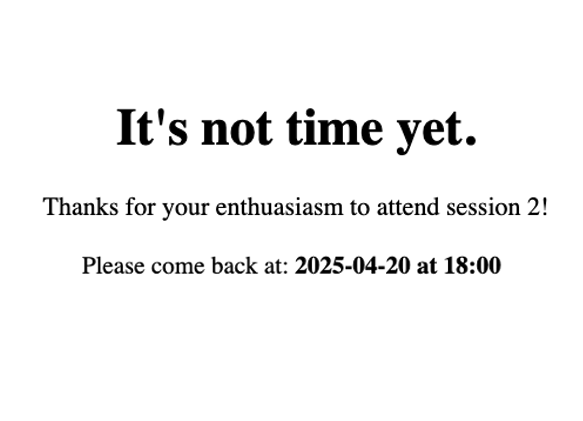
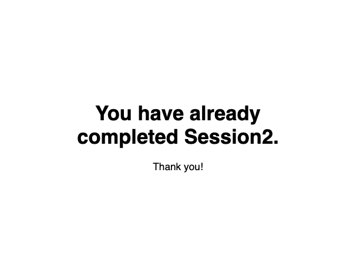

# LongiGate

**LongiGate** is an automatic gatekeeper for **subject ID** and **time detection**, with **repeated-attempt blocking** — built for longitudinal online studies.

Ideal for experiments where **Session 2 stimuli depend on behavior or data from Session 1**.

To allow **LongiGate** to work effectively, it's recommended to enable **"Allow multiple submissions"** in your **Prolific** study settings.  
This ensures participants can return for their follow-up session without issues.
**Recording Prolific IDs -> URL parameters** should be enabled to enable subject tracking

**Citation**
If you use this code in your research, please cite:
Peng, S. (2025). *LongiGate* (Version 1.0.0) [Computer software]. https://doi.org/10.5281/zenodo.15253316

---

## Overview

This toolkit ensures:

- Subject access is only granted at the correct session time
- Repeated or invalid attempts (e.g. due to refresh) are blocked
- Time-based access is coordinated across JavaScript (frontend) and Python (backend)

---

## Components

### 1. `autoDetectTime.js`
A JavaScript utility to detect the subject’s timestamp.  
- Allows entry only if the current time matches the expected Session 2 date/time  
- Otherwise, shows a message instructing them when to return
- *Optional:* For non-dependent condition, you may use an API or GoogleSheet to update timestamps.

---

### 2. `cookieRepetitionBlock.js`
- Blocks subjects from restarting the experiment after technical interruptions (e.g., page refresh).  
- Ensures data integrity by preventing multiple attempts from the same subject.

### 3. `timeStamp.py`
A Python script that generates the expected timestamp file for each subject’s Session 2 access.  
- *Optional:* If your experiment doesn't need Session 1 → Session 2 stimulus linkage, you can swap this out for an API or Google Sheet solution.

---

### 4. `timeStamp.js`
- Computes both the **current participation time** and the **expected time for Session 2**, enabling frontend validation and feedback.
